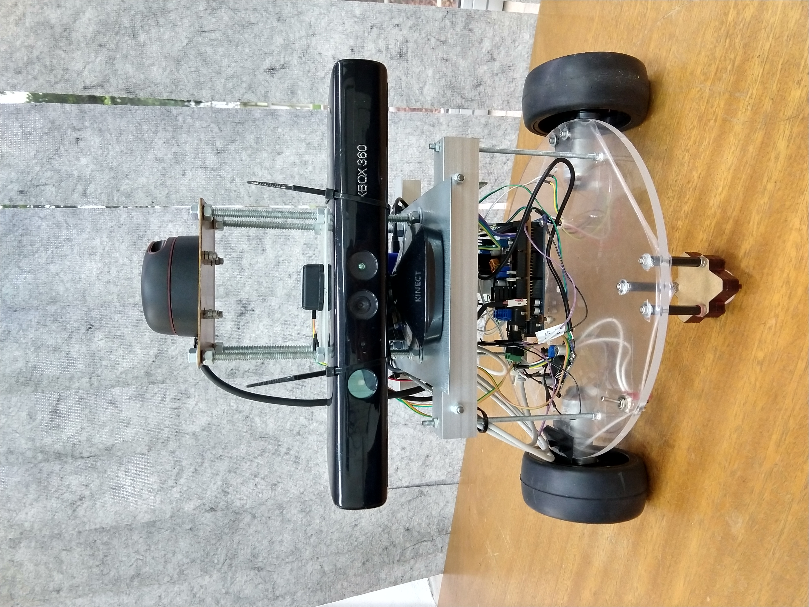

# ISIS: I*TA* S*ystem* for I*ndoor* S*LAM*
Code for the ISIS robot

## Hardware
- SLAMTEC RPLIDAR A2M8 2D lidar scanner
- Raspberry Pi 3B+
- Arduino Mega 2560
- Kinect-for-Xbox
- WiT BWT901CL IMU
- 2x DC motors with optical encoders
## Software
- Ubuntu 16.04
- ROS Kinetic

